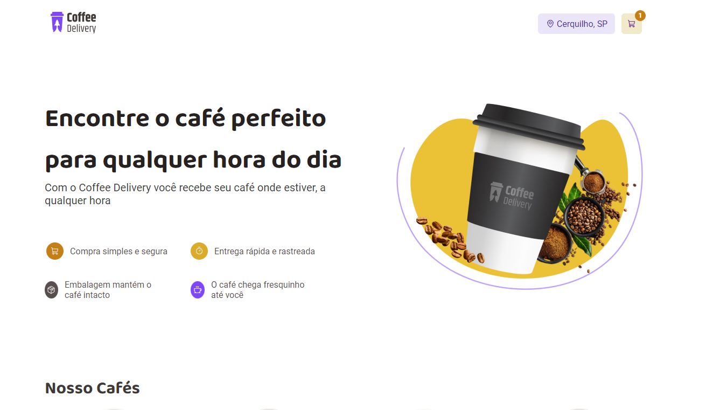

# RocketSeat - Ignite desafio 02 de react Js

## Acessar o projeto link
https://jromarioss-ignite-react-js-desafio02.vercel.app/

## Para instalar as dependências
npm install

## Para iniciar o projeto
npm run dev

